<div align="center">


<h1>Identity Threat Detection</h1>

<p><strong>The Institutional-Grade Platform for Real-Time Telemetry Ingestion, Behavioral Analytics (UEBA), and High-Fidelity Identity Threat Detection.</strong></p>

[]()
[]()
[]()

<br/>

> **"Detection is the new protection."** 
> **Identity Threat Detection** is an enterprise-grade platform designed to provide a secure, measurable, and highly automated foundation for global security operations. It orchestrates the complex lifecycle of identity monitoring—from high-volume log ingestion and UEBA-driven behavioral baselining to multi-signal threat correlation and unified forensic governance.

</div>

---

## 🏛️ Executive Summary

Fragmented identity logs and manual threat hunting processes are strategic security liabilities; lack of centralized identity orchestration is a primary barrier to organizational SRE and SOC maturity. Organizations fail to detect identity compromises not because of a lack of logs, but because of fragmented detection standards, lack of automated behavioral validation, and an inability to orchestrate detection landing zones with operational precision.

This platform provides the **Detection Intelligence Plane**. It implements a complete **Enterprise Detection-as-Code Framework**, enabling SOC and Security teams to manage global identity threats as first-class citizens. By automating the identification of anomalous patterns through real-time telemetry analysis and orchestrating the proactive hunting of dormant compromises, we ensure that every organizational identity—from core directory admins to routine application users—is monitored by default, audited for history, and strictly aligned with institutional detection frameworks.

---

## 📐 Architecture Storytelling: Principal Reference Models

### 1. Principal Architecture: Global Identity Threat Detection & Intelligence Plane
This diagram illustrates the end-to-end flow from multi-cloud telemetry ingestion and UEBA enrichment to multi-signal correlation, proactive hunting, and institutional detection auditing.

```mermaid
graph LR
    %% Subgraph Definitions
    subgraph TelemetryIngress["Multi-Source & Identity Ingress"]
        direction TB
        IdP_Logs["Entra ID / Okta / Ping Logs"]
        Cloud_Telemetry["CloudTrail / Activity Logs"]
        App_Audit["SaaS & Custom App Audits"]
    end

    subgraph IntelligenceEngine["Detection Intelligence Hub"]
        direction TB
        API["FastAPI Detection Gateway"]
        UEBA_Engine["UEBA Behavioral Hub"]
        CorrelationOrch["Multi-Signal Correlation Orch"]
        HuntEngine["Proactive Threat Hunt Hub"]
    end

    subgraph OperationsPlane["Distributed Detection Fleet"]
        direction TB
        IngestionWorkers["Kafka-Driven Log Ingestors"]
        PatternScanners["MITRE ATT&CK Rule Runners"]
        ForensicProxies["Timeline Integrity Proxies"]
    end

    subgraph OperationsHub["Institutional Detection Hub"]
        direction TB
        Scorecard["Detection Maturity Score"]
        Analytics["MTTD & False Positive Stats"]
        Audit["Forensic Detection Metadata Lake"]
    end

    subgraph DevOps["Detection-as-Code Framework"]
        direction TB
        TF["Terraform Detection Modules"]
        CI_CD_Rules["Detection Rule CI/CD Bot"]
        ChatOps["SOC War Room Hub"]
    end

    %% Flow Arrows
    TelemetryIngress -->|1. Submit Telemetry| API
    API -->|2. Enrich Behavioral| UEBA_Engine
    UEBA_Engine -->|3. Correlate Signals| CorrelationOrch
    CorrelationOrch -->|4. Trigger Alert| HuntEngine
    
    HuntEngine -->|5. Execute Assignment| OperationsPlane
    OperationsPlane -->|6. Notify SOC| ChatOps
    API -->|7. Visualize Health| Scorecard
    
    Scorecard -->|8. Track Visibility| Analytics
    Scorecard -->|9. Record Threat| Audit
    
    TF -->|10. Provision Hub| IntelligenceEngine
    CI_CD_Rules -->|11. Deploy Rule| PatternScanners
    Audit -->|12. Improve Rule| UEBA_Engine

    %% Styling
    classDef ingress fill:#f5f5f5,stroke:#616161,stroke-width:2px;
    classDef intel fill:#e8eaf6,stroke:#1a237e,stroke-width:2px;
    classDef operations fill:#e1f5fe,stroke:#01579b,stroke-width:2px;
    classDef ops fill:#ede7f6,stroke:#311b92,stroke-width:2px;
    classDef devops fill:#e8f5e9,stroke:#1b5e20,stroke-width:2px;

    class TelemetryIngress ingress;
    class IntelligenceEngine intel;
    class OperationsPlane operations;
    class OperationsHub ops;
    class DevOps devops;
```

### 2. The Identity Threat Detection Lifecycle Flow
The continuous path of an identity threat from initial ingestion (logs) and UEBA enrichment to active analysis, risk scoring, alerting, and institutional forensic auditing.

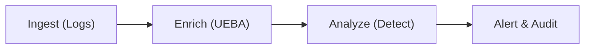

### 3. Distributed Identity Telemetry Topology
Strategically aggregating identity signals from global geographic clusters and multi-cloud IdPs, providing a unified institutional view of global identity threats and detection velocity.

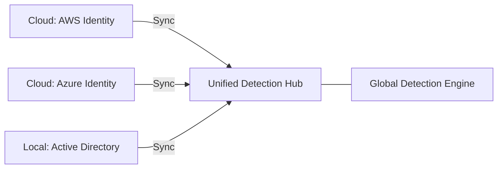

### 4. UEBA Behavioral Baselining Flow
Executing complex logic for building behavioral baselines and identifying anomalies—including unusual login hours, locations, or resource access—ensuring every organizational identity has a verifiable pattern.

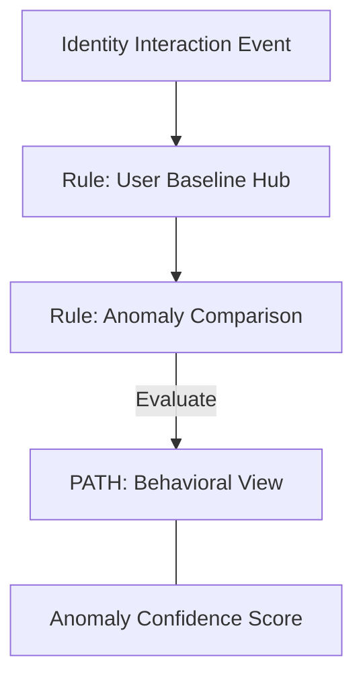

### 5. Multi-Signal Correlation & Risk Scoring Flow
Automatically correlating login attempts with EDR, Network, and Cloud signals to identify high-confidence threats, ensuring zero-latency identification of complex multi-stage attacks.

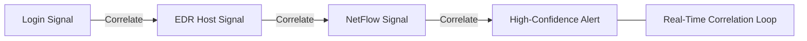

### 6. Detection Engineering Lifecycle (CI/CD) Flow
Managing the lifecycle of a detection rule, handling automated testing and deployment of YAML-based rules into the production detection engine, ensuring institutional rule integrity.

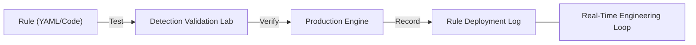

### 7. Institutional Detection Maturity Scorecard
Grading organizational performance based on key indicators: Visibility Depth, Detection Coverage (MITRE ATT&CK), and False-Positive Rate Index.

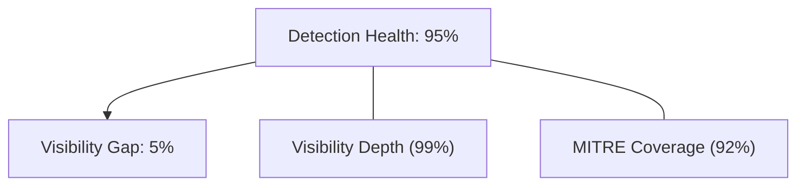

### 8. Identity & RBAC for Detection Governance
Managing fine-grained access to detection hubs, telemetry streams, and audit logs between Detection Engineers, SOC Analysts, and Compliance Auditors.

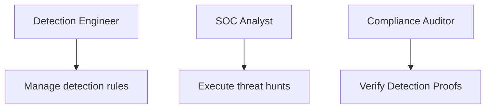

### 9. IaC Deployment: Detection-as-Code Framework
Using modular Terraform to deploy and manage the versioned distribution of the detection tracking hubs, telemetry pipelines, and forensic metadata lakes.

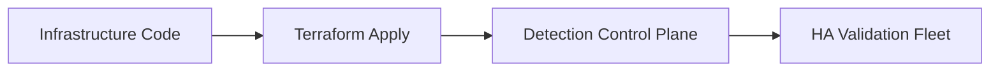

### 10. Threat Hunting & Proactive Identity Search Flow
Using advanced analytics to identify persistent threats, dormant compromises, or unusual identity pattern velocities that could result in institutional risk.

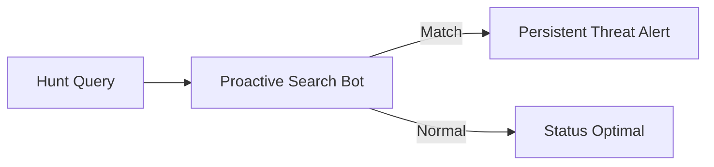

### 11. Metadata Lake for Forensic Detection Audit
Storing long-term records of every signal ingested, every detection triggered, and every hunt executed for institutional record-keeping, compliance auditing, and post-detection forensics.

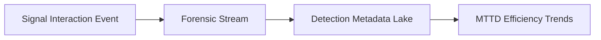

---

## 🏛️ Core Detection Pillars

1.  **Unified Detection Coordination**: Maximizing resilience by centralizing all identity monitoring through a single institutional plane.
2.  **Automated UEBA Enrichment**: Eliminating "low-context" alert scenarios through proactive behavioral and pattern verification.
3.  **Sequential Correlation Intelligence**: Ensuring zero-interruption identification through dependency-aware multi-signal analysis.
4.  **Zero-Trust Rule Protection**: Automatically enforcing least-privilege ingestion and rule evaluation across all detection tiers.
5.  **Autonomous Detection Logic**: Guaranteeing reliability through automated industry-specific identity monitoring runbooks.
6.  **Full Detection Auditability**: Immutable recording of every signal ingested and hunt executed for institutional forensics.

---

## 🛠️ Technical Stack & Implementation

### Detection Engine & APIs
*   **Framework**: Python 3.11+ / FastAPI.
*   **Streaming Hub**: Managed Kafka (MSK) for high-velocity telemetry ingestion and buffering.
*   **Analytics Core**: Custom Python-based logic for UEBA baselining and multi-signal correlation.
*   **Persistence**: PostgreSQL (Detection Ledger) and Redis (Live Signal State).
*   **Auth Orchestrator**: Federated OIDC/SAML for least-privilege detection management access.

### Governance Dashboard (UI)
*   **Framework**: React 18 / Vite.
*   **Theme**: Dark, Indigo, Orange (Modern high-fidelity security aesthetic).
*   **Visualization**: D3.js for identity topologies and Recharts for MTTD velocity analytics.

### Infrastructure & DevOps
*   **Runtime**: AWS EKS or Azure Kubernetes Service (AKS) for management plane.
*   **Forensic Hub**: Managed event sourcing for immutable identity threat timeline reconstruction.
*   **IaC**: Modular Terraform for deploying the detection landing zone and validation fleet.

---

## 🏗️ IaC Mapping (Module Structure)

| Module | Purpose | Real Services |
| :--- | :--- | :--- |
| **`infrastructure/det_hub`** | Central management plane | EKS, PostgreSQL, Redis |
| **`infrastructure/workers`** | Distributed detection fleet | K8s Workers, Cloud APIs |
| **`infrastructure/ingestors`** | Kafka-Driven Telemetry Hubs | MSK, Lambda, Kinesis |
| **`infrastructure/auditing`** | Forensic detection sinks | S3, Athena, Quicksight |

---

## 🚀 Deployment Guide

### Local Principal Environment
```bash
# Clone the detection platform
git clone https://github.com/devopstrio/identity-threat-detection.git
cd identity-threat-detection

# Configure environment
cp .env.example .env

# Launch the Detection stack
make init

# Trigger a mock telemetry ingestion and automated anomaly detection simulation
make simulate-detection
```

Access the SOC Dashboard at `http://localhost:3000`.

---

## 📜 License
Distributed under the MIT License. See `LICENSE` for more information.

---
<div align="center">
  <p>© 2026 Devopstrio. All rights reserved.</p>
</div>
