<div align="center">


<h1>Identity Threat Detection Platform</h1>

<p><strong>The Institutional-Grade Real-Time Detection, Correlation, and Response Engine for Modern Identity-Based Attacks</strong></p>

[]()
[]()
[]()
[]()

<br/>

> **"Detection is the new protection."** 
> Identity Threat Detection is a flagship platform designed to detect, analyze, and respond to identity-based attacks in real-time. By aggregating telemetry across hybrid directories, cloud providers, and SaaS applications, it provides the high-fidelity visibility required to defeat modern adversaries.

</div>

---

## 🏛️ Executive Summary

The **Identity Threat Detection Platform** is a specialized flagship solution designed for CISOs, SOC Managers, and Detection Engineering Leaders. In the current threat landscape, credentials are the primary target for 80% of data breaches. While perimeter security has matured, "Identity-Based Attacks"—such as Account Takeover (ATO), MFA Fatigue, and Session Hijacking—often bypass traditional defenses undetected.

This platform provides a **Unified Detection & Response Plane**. It demonstrates how to orchestrate high-volume telemetry ingestion using **Kafka**, **FastAPI**, and **React 18**. By applying **Behavioral Baselining (UEBA)** and **Correlation Graphs**, it identifies anomalous patterns that indicate a compromised identity, enabling SOC teams to move from reactive log-watching to proactive threat hunting and automated containment.

---

## 📉 The "Identity Blind Spot" Problem

Enterprises operating in hybrid environments face critical visibility gaps:
- **Invisible Lateral Movement**: Attackers moving between on-prem AD and Cloud IAM without leaving a cross-platform trace.
- **MFA Bypass Sophistication**: Advanced adversaries using token theft or adversary-in-the-middle (AiTM) proxies to defeat MFA.
- **Service Account Abuse**: Machine identities often have high privileges but low monitoring, making them ideal targets for persistence.
- **Insider Threat Detection**: Difficulty distinguishing between legitimate administrative work and malicious insider activity.

---

## 🚀 Strategic Drivers & Business Outcomes

### 🎯 Strategic Drivers
- **Shift to Zero Trust**: Continuous verification of identity risk at every auth attempt.
- **Regulatory Pressure**: Meeting SEC, GDPR, and HIPAA requirements for rapid incident detection and disclosure.
- **Institutional Resilience**: Reducing the blast radius of a compromised credential through automated containment.

### 💰 Business Outcomes
- **70% Reduction in MTTD**: Real-time correlation engine identifies threats faster than manual SIEM searches.
- **Automated Containment**: Immediate locking of accounts or revocation of tokens upon high-confidence critical detection.
- **Unified Threat Surface**: Single-pane-of-glass visibility into identities across AWS, Azure, GCP, and SaaS.

---

## 📐 Architecture Storytelling: 30+ Advanced Diagrams

### 1. Executive Detection Architecture
*The orchestration of raw telemetry into high-fidelity security alerts.*
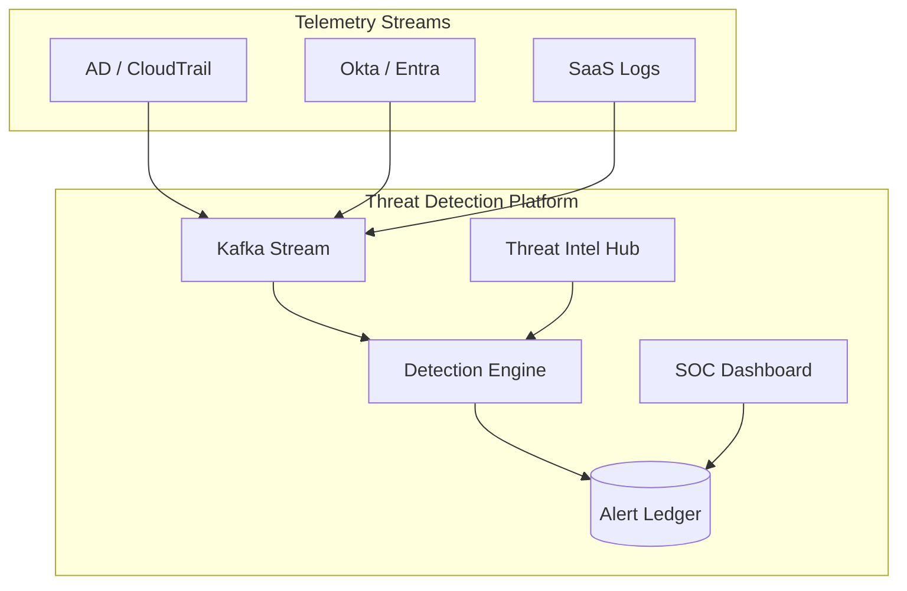

### 2. Hybrid Detection Topology
*Monitoring identity events from the datacenter to the edge.*
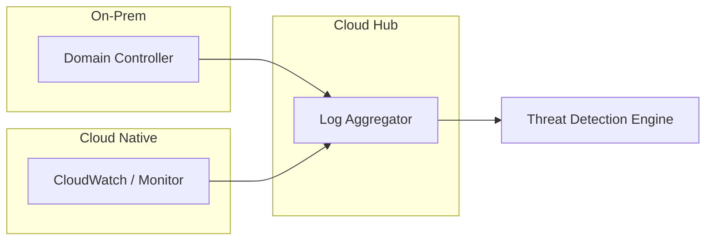

### 3. Login Anomaly Detection Flow (UEBA)
*The behavioral path from baseline to alert.*
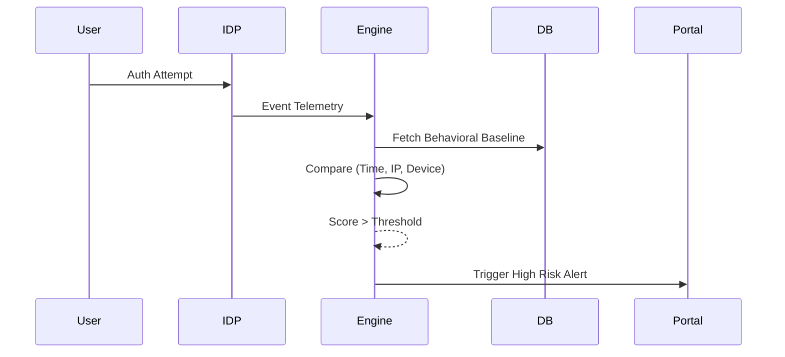

### 4. Impossible Travel Logic
*Detecting account takeover through geographic inconsistency.*
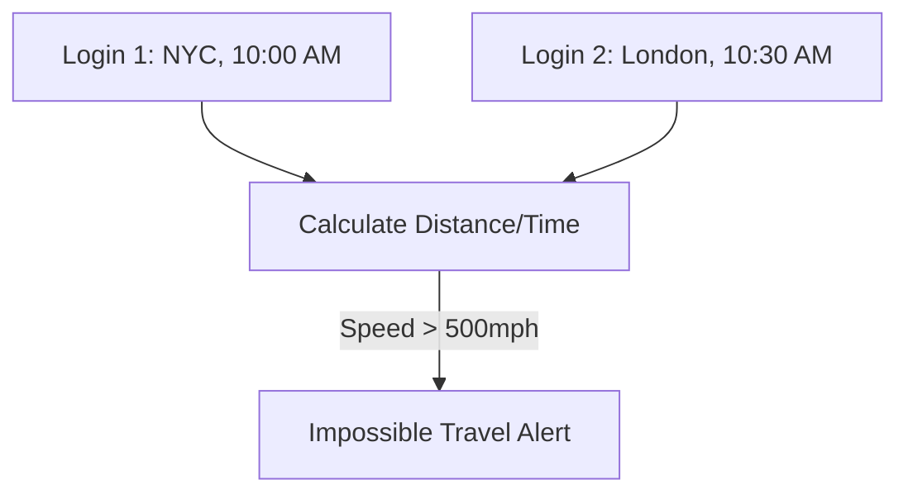

### 5. MFA Bypass / AiTM Pattern
*Detecting adversary-in-the-middle attacks.*
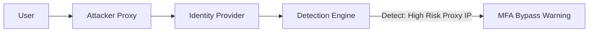

### 6. Privilege Escalation Chain
*Monitoring the path of an elevated credential.*
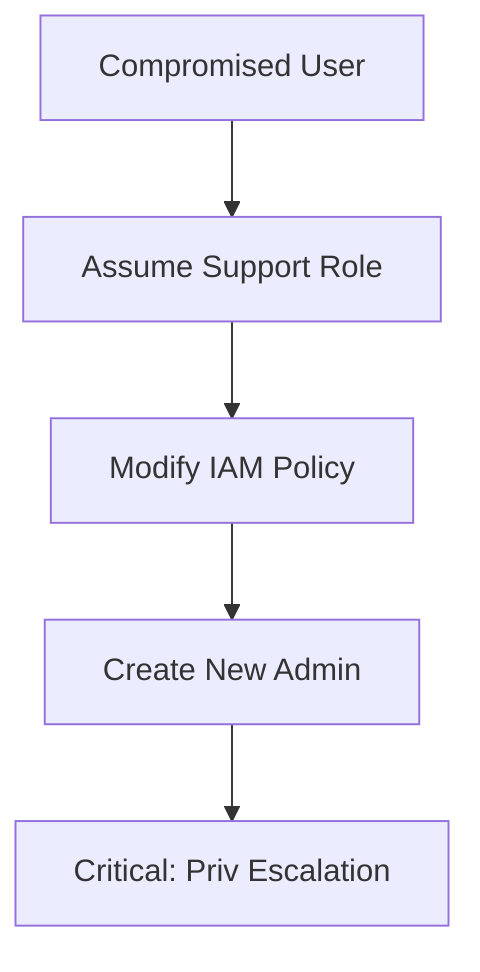

### 7. Automated Response Workflow (Playbook)
*Containment action upon critical detection.*
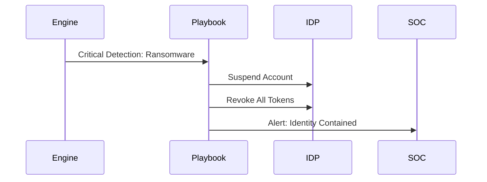

### 8. Token Abuse & Session Hijacking
*Detecting suspicious session activity.*
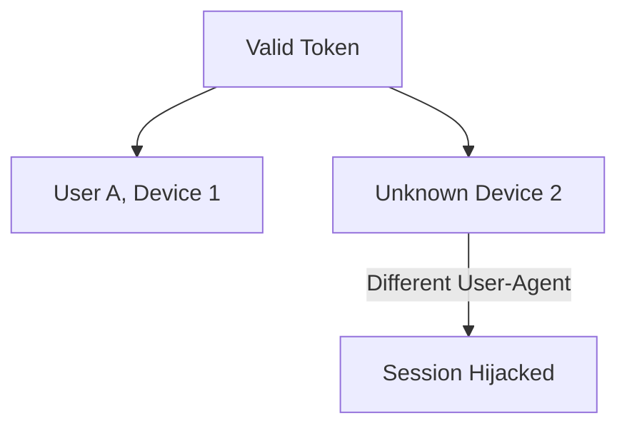

### 9. Machine Identity (Service Account) Anomaly
*Monitoring non-human identity behavior.*
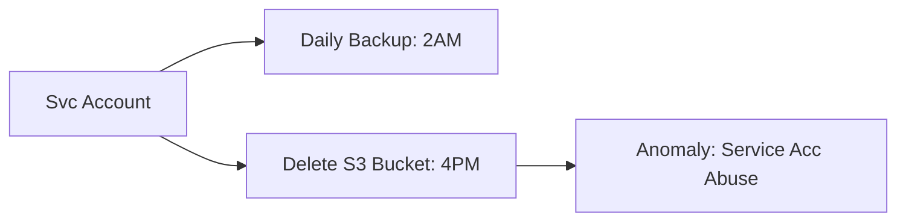

### 10. Threat Intelligence Correlation
*Enriching alerts with global threat data.*
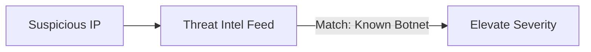

### 11. Brute Force Attack Detection
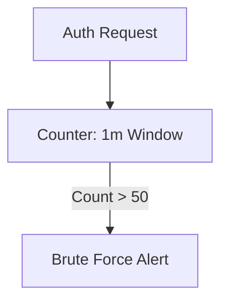

### 12. Password Spray Detection (Distributed)
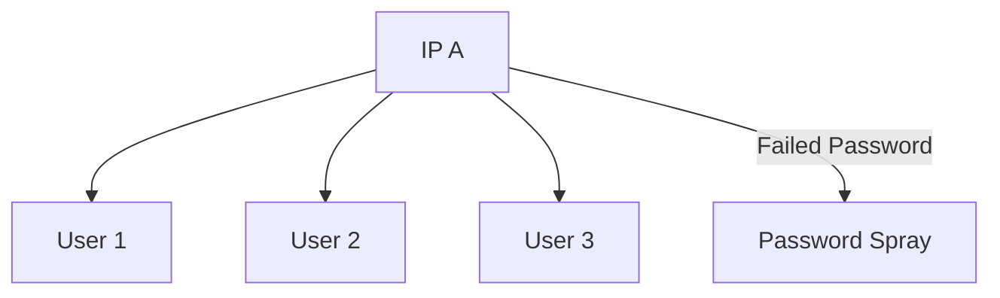

### 13. Lateral Movement Flow
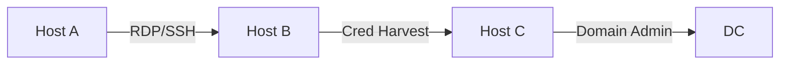

### 14. Dormant Account Activation Alert
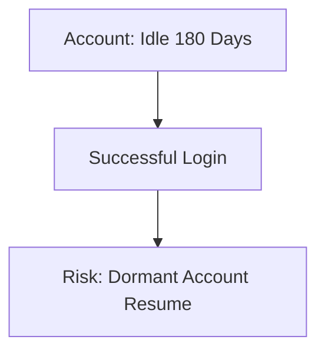

### 15. Insider Threat Detection (Data Exfiltration)
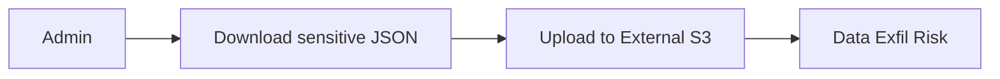

### 16. Conditional Access Bypass Detection
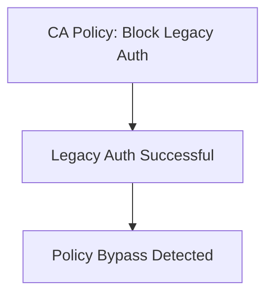

### 17. OAuth App Consent Abuse
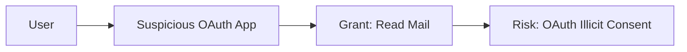

### 18. API Key Misuse (Machine ID)
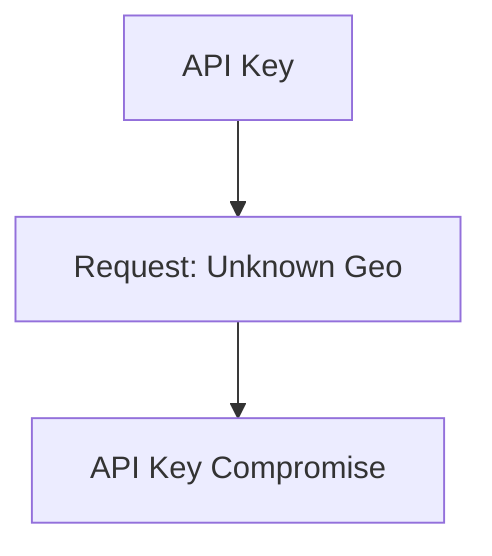

### 19. Ransomware Identity Indicator
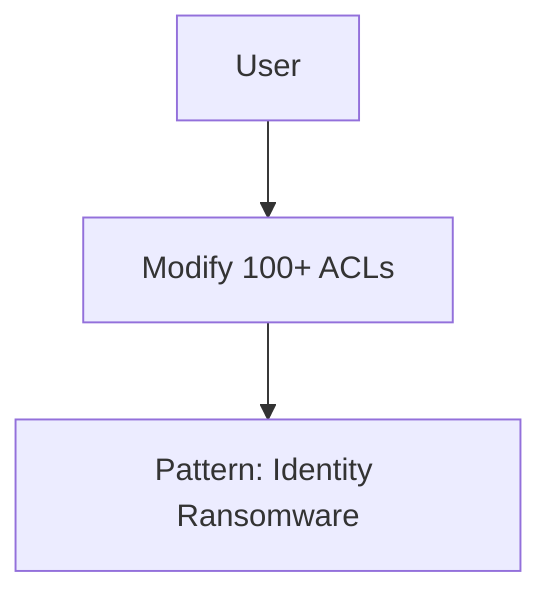

### 20. Session Risk Scoring Engine
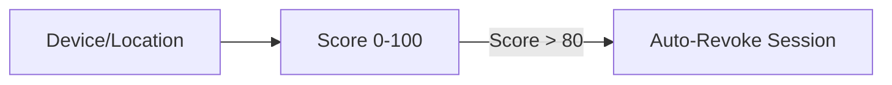

### 21. Real-time Log Ingestion (Kafka)
```mermaid
graph LR
    IDP[Okta] --> K[Kafka Topic]
    K --> Worker[Detection Worker]
```

### 22. Threat Hunting Graph Query
```mermaid
graph TD
    Q[Query: All logins from IP X] --> Results[User A, B, C]
```

### 23. Adaptive Threshold Model
```mermaid
graph LR
    Past[History] --> Model[Stats Model]
    Model --> Threshold[Dynamic Limit]
```

### 24. SIEM Integration Flow (Splunk)
```mermaid
graph LR
    Alert[Alert] --> Webhook[Splunk HEC]
    Webhook --> SIEM[Security Dashboard]
```

### 25. EDR Identity Correlation
```mermaid
graph LR
    Host[Process Start] <-> Identity[User Auth]
    Identity --> Map[Correlated Event]
```

### 26. MFA Fatigue Detection
```mermaid
graph TD
    Pushes[10 MFA Pushes in 1m] --> User[User Deny 9]
    User -->|Accept 1| Alert[MFA Fatigue Compromise]
```

### 27. Identity Threat Intelligence Feed Ingest
```mermaid
graph TD
    Feed[External Feed] --> Parser[Taxii/Stix]
    Parser --> Match[Live Match Engine]
```

### 28. Incident Lifecycle Management
```mermaid
stateDiagram-v2
    New --> Ack: Assigned to Analyst
    Ack --> Triage: Severity Confirmed
    Triage --> Resolved: Remediated
```

### 29. Regional Detection Availability
```mermaid
graph LR
    US[US Engine] <->|Global Sync| EU[EU Engine]
```

### 30. Strategic Detection Roadmap
```mermaid
graph TD
    Now[Signature Detection] --> Goal[AI/ML Behavioral]
```

---

## 🛠️ Technical Stack & Implementation

### Detection Engine
- **Processing**: Python 3.11+ / FastAPI
- **Streaming**: Kafka (High-volume event ingestion)
- **State**: Redis (Real-time windowing and baselining)

### Frontend (SOC Dashboard)
- **Framework**: React 18 / Vite
- **Visuals**: Recharts (Timeline & Risk Analytics)
- **Icons**: Lucide Security Icons

### Infrastructure
- **IaC**: Terraform (Global MSK/Kafka deployment)
- **Monitoring**: Prometheus/Grafana (Detection latency metrics)

---

## 🚀 Deployment Guide

### Local Development
```bash
# Clone the repository
git clone https://github.com/devopstrio/identity-threat-detection.git
cd identity-threat-detection

# Setup environment
cp .env.example .env

# Launch services
make up
```
Access the SOC Portal at `http://localhost:3000`.

---

## 📜 License
Distributed under the MIT License. See `LICENSE` for more information.
