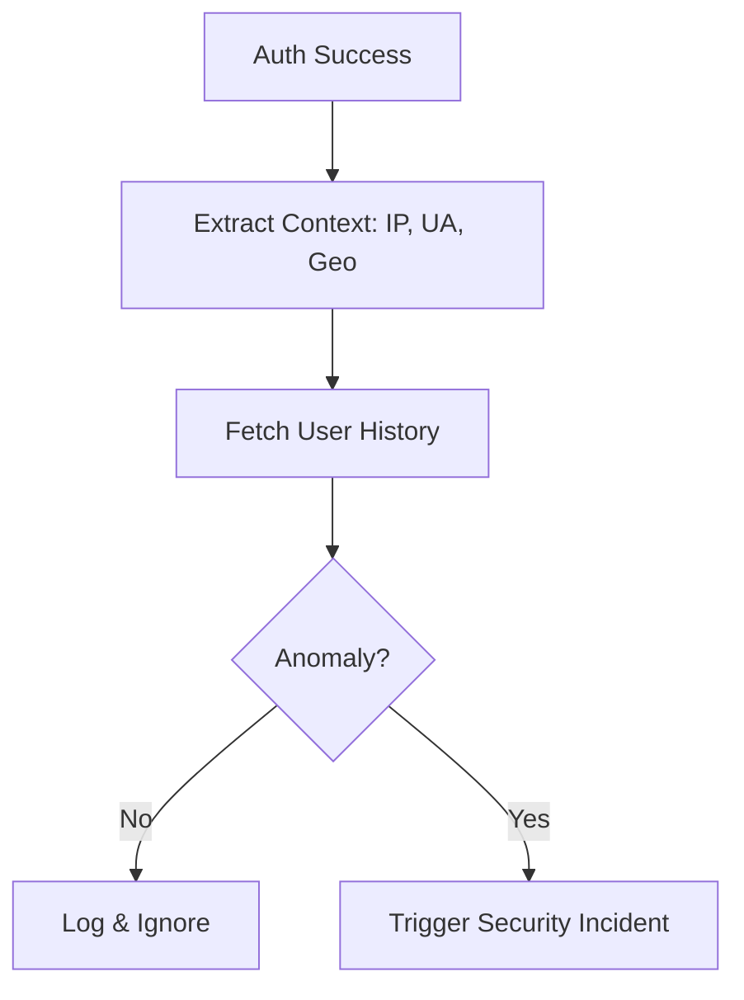
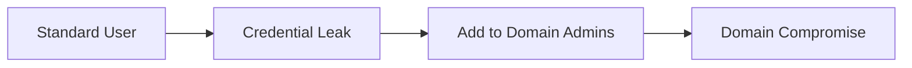
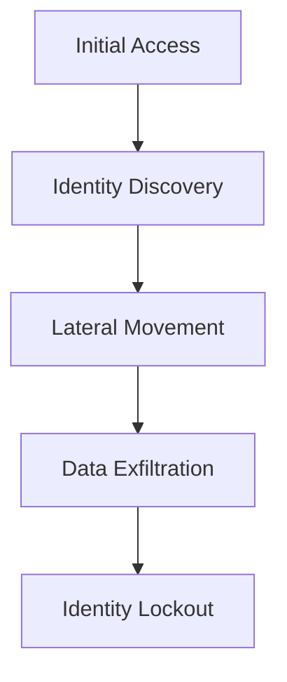

# Architecture & Ingestion Diagrams

## 11. Login Anomaly Flow (Detailed)
*How the detection engine validates every login against behavioral baselines.*

## 14. Privilege Escalation Pattern

## 20. Identity Ransomware Kill Chain

