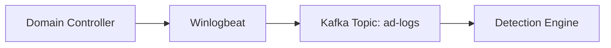
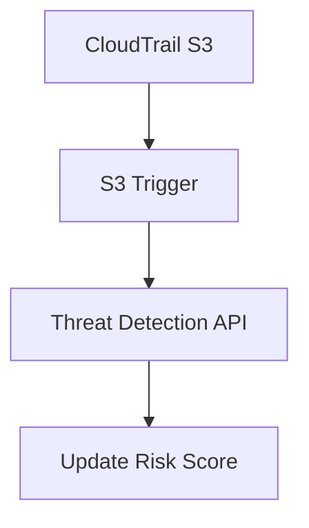
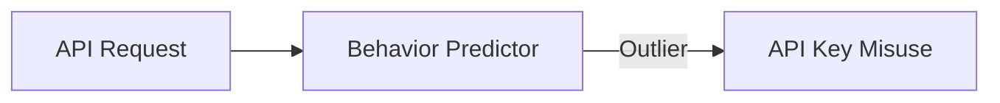

# Detection & Security Diagrams

## 31. Active Directory Log Ingestion

```mermaid
graph LR
    DC[Domain Controller] --> Agent[Winlogbeat]
    Agent --> Kafka[Kafka Topic: ad-logs]
    Kafka --> Engine[Detection Engine]
```

## 34. AWS CloudTrail Scoring Flow

```mermaid
graph TD
    S3[CloudTrail S3] --> Lambda[S3 Trigger]
    Lambda --> API[Threat Detection API]
    API --> Score[Update Risk Score]
```

## 40. API Telemetry Behavioral Model

```mermaid
graph LR
    API[API Request] --> ML[Behavior Predictor]
    ML -->|Outlier| Alert[API Key Misuse]
```
